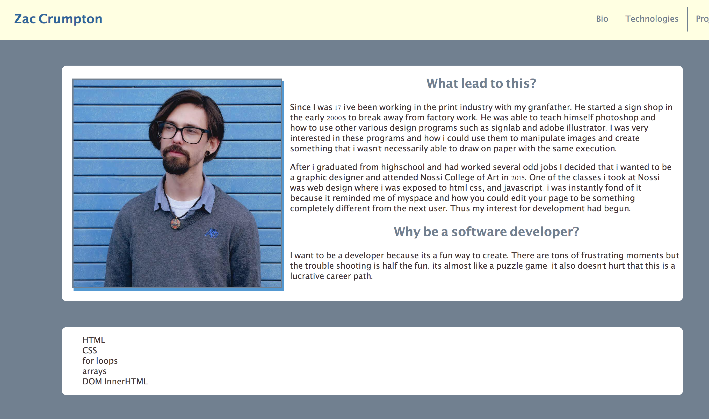

# PERSONAL-BIO-SITE

## Description

This project show cases all the knowledge i've gained during my first 6 months at NSS. It displays every project so far. A project in a project if you will.

## Feature List
- This site shows a navbar that will take the user to different section of the page.

- upon page load you will see a bio card with basic information about the creator

- Projects will be created below via looping through an array of objects and priniting out cards to the dom.

- links to the creators github will be featured on these product cards

## Screenshots

## How to Run

- Clone down this repo

- Make sure you have http-server installed via npm. If not get it HERE](https://www.npmjs.com/package/http-server).

- On your command line run `hs -p 9999`

- In your browser go to `http://localhost:9999`

## Contributors

[Zac Crumpton](https://github.com/ZacCrumpton)